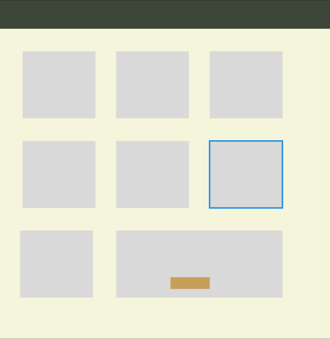
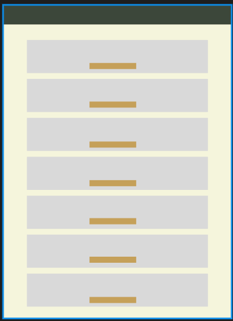
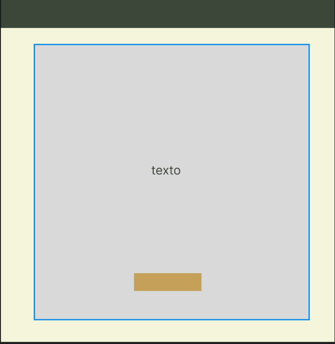
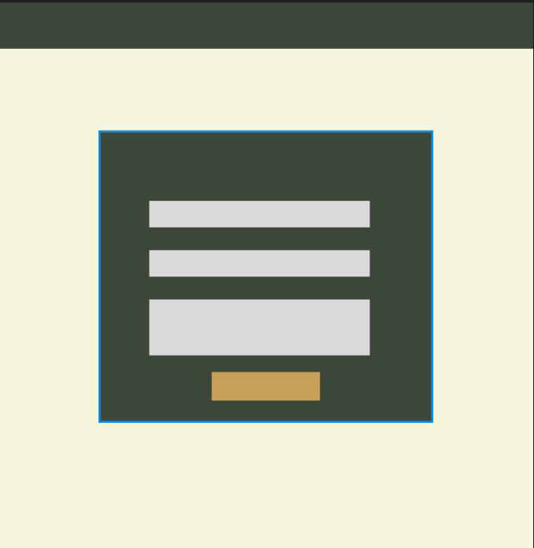

# Markdow do trabalho escolar 

 sera utilizado bootstrap.

---

nao sera utilizado uma patten porem sera utilizado BEM CSS

---

# esquema de cor

* sera utilizado :root{}
* as cores serao esquemadas em hexadecimal no :root{} porem depois eu usarei os nomes das cores pra usar no codigo de css inteiro

---

# regras do javascript

o projeto tem:
* funçoes
* classes com constructor
* sera utilizado para fazer animações 

---

# regras do html

o evento de click utiliza o addEventListenner

** o html sera fluido **

---

o trabalho englobara somente o desktop e mobile

---

# Cores que serão utilizadas:

* bege deserto (#E6D5B8)
* Verde Romano (#3C473A)
* Areia Clara (#F5F5DC)
* Ouro Envelhecido (#C5A059)

# imagens dos mainframes

